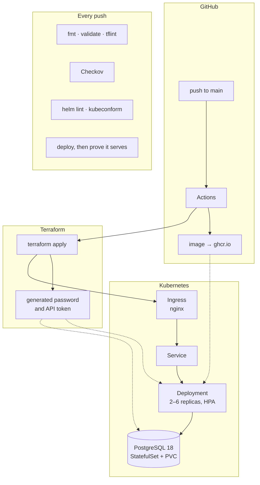

# lead-triage platform

The infrastructure for [lead-triage](https://github.com/Mark1Anthony/lead-triage),
written as code: a Kubernetes deployment, the Terraform that creates it, the
pipeline that rolls it out, and the checks that keep all three honest.

The application is the payload here, not the point. The point is what it takes
to run one reliably.

**Everything in this repository runs at no cost.** The cluster is created inside
the CI runner and destroyed in the same job; images go to GitHub's registry.
`terraform/azure/` describes the same platform on Azure and is validated,
linted and security-scanned on every push — see [What is real and what is
not](#what-is-real-and-what-is-not), which says plainly which parts have run
against a live cloud and which have not.

## Architecture



## What this demonstrates

| | Where to look |
|---|---|
| Infrastructure as code, applied for real | [`terraform/cluster/`](terraform/cluster) — creates namespace, secrets and both releases |
| The same platform on Azure | [`terraform/azure/`](terraform/azure) — AKS, PostgreSQL Flexible Server, Key Vault, private networking |
| Kubernetes beyond `kubectl apply` | [`charts/`](charts) — probes, HPA, disruption budget, topology spread, read-only root filesystem |
| CI/CD | [`.github/workflows/`](.github/workflows) — build, deploy, verify, tear down |
| Secret handling | No credential is committed. Terraform generates them; Azure uses OIDC and workload identity, so there is nothing to rotate |
| Observability | Log Analytics, Container Insights and a spending budget with alerts in [`terraform/azure/observability.tf`](terraform/azure/observability.tf). Metrics and dashboards are the next piece and are not here yet |
| Cost control | A budget with alerts at 80% actual and 100% forecast, because Azure enforces no cap |
| Judgement | [`docs/adr/`](docs/adr) — the decisions, including the ones that went the boring way |

## What is real and what is not

Portfolio repositories are easy to overstate, so:

| Part | Status |
|---|---|
| Kubernetes deployment | **Runs.** Every push creates a three-node cluster, deploys, and fails the build if the service does not answer |
| `terraform/cluster/` | **Applied for real** in that job, then destroyed |
| Charts | **Rendered and schema-checked**, then actually installed |
| NetworkPolicies | **Installed and traffic flows through them** in that job. What is not proven is that they *block* what they should — that needs a cluster whose CNI enforces them, which kind's does not |
| `terraform/azure/` | **Not applied.** Validated, linted and scanned on every push. Applying it creates billable resources, which is a deliberate no |

The Azure configuration is written to be applied, not to look like it could be.
[`docs/runbook.md`](docs/runbook.md) has the sequence, and what it costs.

## Run it yourself

Needs Docker, [kind](https://kind.sigs.k8s.io/), kubectl, Helm and Terraform.

```bash
kind create cluster --config kind/cluster.yaml

kubectl apply -f https://raw.githubusercontent.com/kubernetes/ingress-nginx/main/deploy/static/provider/kind/deploy.yaml
kubectl wait -n ingress-nginx --for=condition=ready pod \
  --selector=app.kubernetes.io/component=controller --timeout=180s

cd terraform/cluster
terraform init
terraform apply
```

Then http://lead-triage.localtest.me — that hostname resolves to 127.0.0.1 for
everyone, so nothing needs editing in `/etc/hosts`.

```bash
curl -s http://lead-triage.localtest.me/health
# {"status":"ok","mode":"demo","database":"postgres",...}
```

`"database":"postgres"` is the assertion that matters: the application falls
back to SQLite when it cannot see a connection string, so a 200 on its own
would not prove the secret ever reached the pod.

Tear it down with `terraform destroy` and `kind delete cluster --name lead-triage`.

## Layout

```
charts/            Helm charts: the application, and PostgreSQL standing in
                   for the managed instance Azure would provide
terraform/
  cluster/         What actually runs. Namespace, generated secrets, releases
  azure/           The production design: AKS, PostgreSQL, Key Vault, OIDC
kind/              Cluster definition — three nodes, ingress ports published
.github/workflows/ validate.yml (static checks) · cluster.yml (deploy and prove)
docs/adr/          Why things are the way they are
scripts/           One-time bootstrap for the Azure remote state
```

## License

MIT — see [LICENSE](LICENSE)
